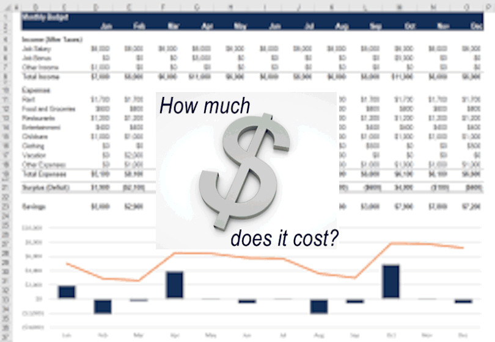

# Business tools for Engineers: Cost Benefit Analysis

***“How much will it cost?”*** The question I have been asked almost every time I bring forth the idea of a new technology or process to a company. That, my friends, is a bit of treacherous waters that I hope to provide you with a map through. Indulge me for awhile and I will  help you understand the formula for success that is a proper Cost Benefit Analysis.

For the sake of brevity, whether you are performing a BCA for a new piece of software, new practice, new tool, etc, we will refer to it as a widget. And while all widgets are not equal, a BCA will retain a set of core elements that can be compared, apples to apples as it were.

There are three main sections of a good BCA. First, the cost of the new widget. Second, the cost of the old widget, and finally, the cost of other widgets in comparison, if any. Each of these sections can be broken further into the same set of elements. Lets dive into each of these elements one at a time to provide understanding and details needed to make them effective. 

To make it more relatable,  let's use a hypothetical exercise. We have an existing piece of software, maintained on premise, to store all of our system logs across the company. Leadership has asked you how much it will cost to replace it with a cloud solution.

*Element one* is the initial cost. This is quite simply the license, expense for hardware, or cost in time to create the new policy or process. In our exercise, this would be the license contract for a S.A.A.S. log storage solution.  Let’s say for 20tb of logs the license costs $2,500 U.S. dollars a year. That is going to be the initial cost of the solution. Let's move into the less-thought-about costing elements to find out the final costs, shall we?

*Element two* is the setup costs. Here we are looking at any additional hardware, software, and storage costs incurred to use this new widget. In our example, we are buying a SAAS so there are no servers on our side to setup. However, there will be a cost in engineer hours for integrating it within our existing ecosystem. That will be the next element. (If this widget had been a new on premise setup, we could have calculated the costs of a new server set, either bare-metal or virtual machine, storage costs, costs of a new database with it’s storage, load-balancer costs.) Instead, there is a hidden cost of using SAAS if your solution is already in the cloud. Most cloud providers charge you for outbound data transfers. You can find the costs buried in your billing or from deep in their pricing documentation. For instance, AWS costs for 10gb a day outbound traffic via a NAT gateway would be: $0.045 per hour * 24 hours in a day, plus $0.045 per gb * 10 gb. So the formula would look like: (24 * 0.045) + ( 10 * 0.045) = $1.53 per day. For an annual cost of: 1.53*365 = $558.45.

*Element three* is engineering hours. This is the cost in engineer hours required to get the new item implemented. The time to setup and configure the account to integrate with our company’s SSO and security standards in this case. Lets say it will take a typical scrum sprint, or two weeks, to complete this setup for a single engineer. That’s 80 engineer hours at the cost of an engineer. In most companies, either your manager or a member of your Human Resources can give you an average hourly rate for engineer within the company. You can use that for this calculation. Lets say it’s somewhere in the ball park of $40/hr. Then this cost element would be 80*40=$3200.

*Element four* is the upkeep costs. This is often the killer for any BCA that gets forgotten. The man hours of user maintenance, standardization enforcement, adding new internal widgets to report to it, data rotation, cleanup tasks, and agent updates. This will never be 100% accurate but the best way I have found to estimate this cost is to assume 5-10% of one engineer’s time over the course of a year depending on premise or SAAS. With this being a SAAS we will go with the 5% mark. So let's find the annual hours with this formula: (40*52)*0.05=104. Multiply that by the price of those hours from element three so: 104*40=$4,160/year.

Now we can plug in that total cost: 2500 + 558.45 + 3200 + 4160 = $10,418.45/year. That would be the cost of the new widget annually. 

*Element five*, the final element is the benefit. This is where you can evangelize the better process; easier use, quicker integration, etc. that this new widget provides. Once you list out these features, I would suggest some screen shots of the UI, etc. but not too many. One small one per highlight tends to be sufficient.

### **Example:**  
> | Cost Element | Quantity | Amount per Item | Total |  
> | --- | --- | --- | --- |  
> | Liscence | 1 | 2500 | 2500 |  
> | Data Transfer | 1 | 1.53 | 558.45 |  
> | Setup | 1 | 3200 | 3200 |  
> | Upkeep | 104 | 40 | 4160 |  
> | --- | --- | --- | --- |  
> | Grand Total | | | 10418.45 |  
> 
>  * No more servers to maintain for the project
>  * More storage at a cheaper cost
>  * Better UI interface
>  * Better Search capabilities
>  * Machine Learning Assistance for anomoly detection
>  * The Ability to build graphs from Log based data via common syntax
>  * The Ability to Extend the interface with custom NodeJS additions using sdk

After you have the section for the new widget you want, be sure to plug in the same process for the existing widget, and any other widgets evaluated for easy comparison. 

With this tool in your toolbox you can see for yourself if the new widget is worth the purchase as well as show it off to your leadership, easily and confidently.

###### About The Author
Jason Lang is a long time advocate of SOA architecture, LEAN practices and the DevOps culture.  
[Email: ranathalan.desbw@gmail.com](mailto:ranathalan.desbw@gmail.com)  
[LinkedIn](https://www.linkedin.com/in/jason-lang-1525a86b/)  
